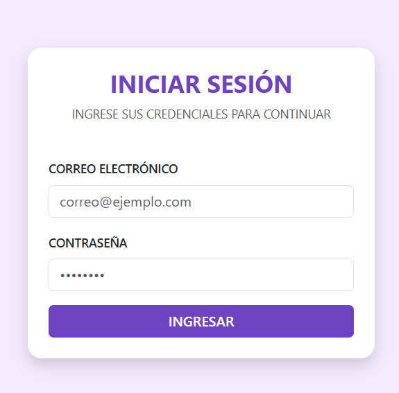
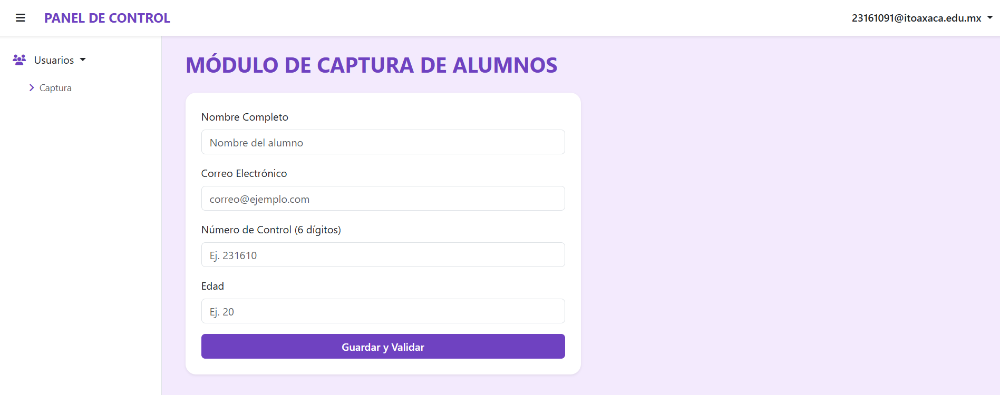

# Sistema Web de Acceso y Captura

## Integrante
* Xana Amalinalli Pérez Jiménez

## Descripción Breve
Sistema web desarrollado en HTML, CSS y JavaScript que simula un flujo de autenticación seguro (Login) y redirección a un panel de control con barra lateral (Sidebar), barra superior (Navbar) dinámica y formularios con validación estricta y alertas modales.

## Especificaciones Técnicas
* **Framework CSS:** Bootstrap 5.3
* **Librería de Utilidades:** Integración con `utileria.js` vía CDN (jsDelivr).
* **Almacenamiento Local:** Uso de `localStorage` para persistir la sesión simulada del usuario entre pantallas (`login.html` y `index.html`).

## Flujo del Proyecto
1. El usuario ingresa sus credenciales en `login.html`.
2. Las funciones de validación evalúan el formato de correo y contraseña.
3. Al ser correctas, se redirige a `index.html` reflejando el correo en la barra superior.
4. El sistema permite gestionar la captura de alumnos validando la longitud del número de control (6 dígitos) y evaluando la mayoría de edad mediante un modal interactivo.
5. El botón de salida limpia la sesión y retorna al login.

## Capturas de Pantalla del Flujo

### Pantalla de Inicio de Sesión (Login)

### Pantalla del Sistema (Panel de Control y Módulo)

